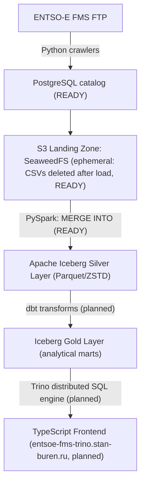

<div align="center">

# ENTSO-E FMS Trino platform

### *The European power grid, finally queryable.*

From a raw FTP dump of over 218,000 files to a modern data lakehouse with SQL querying.

<br/>

<!-- ═══════════════════════ STACK ═══════════════════════ -->


<!-- ═══════════════════════ VITALS ═══════════════════════ -->


<br/>

<b>
<a href="#what-this-project-does">Overview</a> ·
<a href="#architecture-seven-layer-design">Architecture</a> ·
<a href="#core-components">Components</a> ·
<a href="#performance-metrics">Metrics</a> ·
<a href="#project-structure-and-catalogs">Project structure</a> ·
<a href="#getting-started">Getting started</a> ·
<a href="#running-file-ingestion">Run ingestion</a> ·
<a href="#useful-links">Links</a>
</b>

</div>

<br/>

---

## What this project does

> [!NOTE]
> **Context:** The ENTSO-E Transparency Platform coordinates the transmission of operational data for one of the world's largest integrated power systems, covering 36 countries and 40 transmission system operators (TSOs). Under EU Regulation 543/2013, TSOs publish metrics on grid load, generation, cross-border flows, market prices, balancing, and outages.
>
> The raw data is stored on a public File Management System (FMS) FTP server containing over 218,000 files across 89 production publications. Formats range from tab-separated values (TSV) to ZIP archives containing XML, and files are nested deep within directory hierarchies.

> [!WARNING]
> **Problem:** Working with this data typically requires manually scanning the FTP server, guessing schemas, and downloading large volumes of files to parse locally. There is no queryable database or central catalog of files.

<br/>

## Architecture: seven-layer design

The platform runs on self-hosted infrastructure and covers the complete lifecycle from FTP ingestion to SQL queries.



<details>
<summary><b>Plain-text version of the diagram</b> (click to expand)</summary>

```
ENTSO-E FMS FTP → [Python crawlers] → PostgreSQL catalog (READY)
     ↓
S3 Landing Zone (SeaweedFS, ephemeral: CSVs deleted after load, READY)
     ↓ [PySpark: MERGE INTO (READY)]
Apache Iceberg Silver Layer (Parquet/ZSTD)
     ↓ [dbt transforms (planned)]
Iceberg Gold Layer (analytical marts)
     ↓ [Trino distributed SQL engine (planned)]
TypeScript Frontend (entsoe-fms-trino.stan-buren.ru, planned)
```

</details>

<br/>

## Core components

<table>
<tr>
<td width="30"><h3>1</h3></td>
<td>

**PostgreSQL catalog:** A complete mirror of the FTP directory structure containing over 74,000 records. This database catalog replaces a 92 MB YAML configuration that consumed 12.4 GB of RAM during parsing and caused out-of-memory errors. The PostgreSQL database provides O(1) memory consumption, ACID transactions, and recursive common table expressions (CTEs) for folder tree navigation ([ADR-008](docs/adr/ADR-008-migration-of-fms-metadata-catalog-from-yaml-to-postgresql.md)).

</td>
</tr>
<tr>
<td><h3>2</h3></td>
<td>

**Delta synchronization:** Instead of running a full FTP crawl that takes between 1.5 and 3 hours, the pipeline compares directory timestamps against `Export_log_r3.csv` and only checks modified folders. Terminating the sync after three consecutive unchanged folders reduces incremental runtimes ([ADR-007](docs/adr/ADR-007-separation-of-metadata-refresh-from-ingestion.md)).

</td>
</tr>
<tr>
<td><h3>3</h3></td>
<td>

**Ephemeral landing zone:** CSV files are stored in S3 (SeaweedFS) temporarily during the Iceberg load and are deleted once the merge operation completes. The database maintains a registry of ingested files using xxHash deduplication and preserves an audit trail ([ADR-004](docs/adr/ADR-004-ephemeral-landing-event-driven-staging.md)).

</td>
</tr>
<tr>
<td><h3>4</h3></td>
<td>

**FMS data contracts:** YAML schemas define expected columns, data types, and enum values for each of the 89 publications. A schema validation step checks files during ingestion and stops the pipeline with a descriptive error if there is a mismatch, preventing silent downstream corruption ([ADR-009](docs/adr/ADR-009-fms-metadata-catalog-matching-and-contracts.md)).

</td>
</tr>
<tr>
<td><h3>5</h3></td>
<td>

**Resilience mechanisms:** Implements circuit breakers (10-second and 30-second timeouts for FTP requests), load shedding (a 30-day freshness window to skip downloading historical data), and state chunking to process large lists of files in batches rather than a single database transaction.

</td>
</tr>
</table>

<br/>

## Performance metrics

<div align="center">

| Metric | Before | After |
|---|---|---|
| Timestamp parsing (`Export_log`) | 67 seconds (pandas) | 0.06 seconds (`datetime.fromisoformat`, 1,140x speedup) |
| Memory (catalog) | 12.4 GB RAM (YAML in memory) | O(1) (PostgreSQL) |
| Full FTP crawl | 1.5 to 3 hours | ~5 minutes (delta sync) |
| Changed-file detection | Full rescan of 218K+ files | SQL anti-join: `landing_registry` left outer join `ingestion_registry` (matches new or failed files only) |
| EIC codes in PyPSA (related project) | 19 out of 165,064 (0.01%) | 1,904 (57% of ENTSO-E ceiling, 100x increase) |

</div>

- **Design decisions:** The system architecture is documented across 10 Architecture Decision Records (ADRs) detailing decisions, tradeoffs, and consequences.
- **Idempotency:** All 89 publications process uniformly under strict data contracts. Ingestion is idempotent and can run from scratch at any time to recreate the lakehouse state.

<br/>

---

## Core concept

This project documents the folder structures and business logic of the ENTSO-E Transparency Platform and provides utilities to upload FMS files to S3-compatible storage (such as a local SeaweedFS instance or AWS S3).

## Goals

The repository helps developers get started with the ENTSO-E Transparency Platform by documenting its directory structure and providing pre-built schemas and ingestion scripts.

## The ENTSO-E Transparency Platform

The ENTSO-E Transparency Platform serves as the central data registry for the European electricity grid. Under EU Regulation 543/2013, 40 Transmission System Operators (TSOs) across 36 countries, along with power exchanges and generator operators, must publish system metrics including load, generation, cross-border flows, and pricing. This information is key for energy analysts, data engineers, and power traders.

<br/>

---

## Project structure and catalogs

### Platform metadata and schemas

| Step | Goal | Location |
|:---:|---|---|
| 1 | **See available domains** | [fms_metadata/overview.yml](fms_metadata/overview.yml) |
| 2 | **Understand business logic** | [fms_metadata/business_context_catalog/entsoe_domains_overview_detailed.yml](fms_metadata/business_context_catalog/entsoe_domains_overview_detailed.yml) |
| 3 | **See each file's metadata** (sizes, checksums, updates) | `fms_metadata/physical_catalog/` (populated after catalog refresh) |

**Other reference files:**
- [docs/reports/fms_metadata_report.md](docs/reports/fms_metadata_report.md): A summary of the ENTSO-E File Management System (FMS) structure.
- [config/entsoe_api_limits.yml](config/entsoe_api_limits.yml): API query rate limits.
- [config/paths.yml](config/paths.yml): Single source of truth for repository paths.

<br/>

### Repository utilities

- **Available commands:** Defined in the [justfile](justfile).
- **Source code:** Located in [src/entsoe_pipeline/](src/entsoe_pipeline/).

<details>
<summary><b>Source folder structure</b> (click to expand)</summary>

```
src/entsoe_pipeline/
├── api/
├── config/
├── db/
├── fms_metadata/
├── io/
├── lakehouse/
├── logger/
├── notebooklm/
├── preflight/
├── spark/
└── vendor_patches/
```

</details>

- **Configuration templates:** Located in the [config_env_example/](config_env_example/) directory.
  These templates follow the centralized configuration structure detailed in [ADR-001](docs/adr/ADR-001-centralized-yaml-configuration.md).

<details>
<summary><b>Configuration templates structure</b> (click to expand)</summary>

```
config_env_example/
├── bucket.yml
├── enviroment.yml
├── hosts.yml
├── my_entsoe_domains.yml
├── notebooklm.yml
├── ports.yml
├── region.yml
├── urls.yml
└── volumes.yml
```

</details>

- **Ingestion jobs:** Located in the [jobs/](jobs/) directory.

<details>
<summary><b>Jobs folder structure</b> (click to expand)</summary>

```
jobs/
├── intermediate/
├── marts/
├── staging/
│   └── ingest_landing_csv_to_lakehouse.py
├── landing/
│   ├── ingest_my_entsoe_domains.py
│   └── prepare_landing_ingestion.py
└── refresh_fms_metadata.py
```

</details>

- **Developer tools:**
  - Pre-commit configuration: [.pre-commit-config.yaml](.pre-commit-config.yaml)
  - Lint rules: [ruff.toml](ruff.toml)
  - Environment variables template: [.env.example](.env.example)
  - Build definitions: [pyproject.toml](pyproject.toml)

<br/>

### Testing

A pre-commit gate enforces an 80% test coverage minimum. The test suite contains 244 tests covering 82.51% of the codebase.

Ruff handles formatting and linting, Pytest and Mypy manage unit testing and type verification, and Trivy scans for secrets and vulnerabilities during the pre-commit and CI/CD stages.

<details>
<summary><b>Test folder structure</b> (click to expand)</summary>

```
tests/
├── jobs/
├── pre_commit/
├── test_api_client.py
├── test_config_loader.py
├── test_config_metadata.py
└── ...
```

</details>

<div align="center">

</div>

<br/>

### Path management

Refer to [ADR-002](docs/adr/ADR-002-centralized-path-ssot-configuration.md) for design details.

System paths are declared relative to the project root in the single source of truth file: [config/paths.yml](config/paths.yml). Mappings load dynamically at runtime and can be imported as standard `Path` objects:

```python
from entsoe_pipeline import PROJECT_ROOT, DATA_DIR, CONFIG_DIR
```

### Configuration loading

Refer to [ADR-003](docs/adr/ADR-003-config-loader-public-interface-design.md) for implementation details.

A centralized loader handles application parameters (such as network ports, hosts, API rate limits, and storage buckets). You can access these settings using typed interfaces:

```python
from entsoe_pipeline import get_config, get_ports_config, get_hosts_config
```

<br/>

---

## Getting started

1. **Create an account:** Register on the [ENTSO-E Transparency Platform](https://transparency.entsoe.eu/).
2. **Add credentials:** Add your email and password to the local `.env` file (copied from [.env.example](.env.example)).
   The platform provides two environments: production (PROD) and testing (IOP). Testing and development should be done using an IOP account before fetching production data. Note that directory structures differ between these environments.
3. **Configure S3:** Add S3-compatible storage credentials to the local `.env` file.
4. **Docker configuration:** Update [docker/docker-compose.yml](docker/docker-compose.yml) to configure services as needed.
5. **Initialize configuration:** Run `just init-config` to copy template files from `config_env_example/` to `config_env/`, then edit the configurations.
6. **Local storage:** Run `just lakehouse-up` followed by `just lakehouse-test` to start and verify a local SeaweedFS instance.
7. **Clean developer artifacts (optional):** Run `just clean-stan-buren-learning-stuff` and `just remove-agents-folder` to remove setup artifacts.

<br/>

---

## Refreshing catalog metadata

To update local metadata catalogs and database tables:

1. **Root-level overview:** Run `just fms-overview` to crawl the remote FMS directory structure and regenerate the root-level [overview.yml](fms_metadata/overview.yml).
2. **Directory tree:** Run `just fms-tree` to generate [overview_tree.yml](fms_metadata/overview_tree.yml).
3. **Database catalog refresh:** Run `just refresh-fms-metadata` to execute the three-phase metadata ingestion job. This job uses delta synchronization, comparing directory timestamps against `Export_log_r3.csv` to only crawl directories that have changes.
   - To force a full crawl instead of an incremental update, run:
     ```bash
     just refresh-fms-metadata flags="--full-scan"
     ```
   - For testing or local runs where heavy domains (like Transmission and Balancing) should be skipped, run:
     ```bash
     just refresh-fms-metadata flags="--test"
     ```

   > [!NOTE]
   > A full crawl traverses the entire ENTSO-E FMS directory structure (historical archives and active domains) across approximately 2,800 folders, requiring around 40 minutes to run from scratch.

4. **Landing bucket schema contract:** Run `just fms-folder-schema` to build the directory schema contracts and populate the `landing_folders_schema` table.

<br/>

---

## Switching environments (IOP or PROD)

| Command | Effect |
|---|---|
| `just iop` | Switch to the IOP environment |
| `just prod` | Switch to the PROD environment |

This updates the active environment in [enviroment.yml](config_env_example/enviroment.yml).

<br/>

---

## Running file ingestion

### Preparation

Update the active mode and configuration variables in [my_entsoe_domains.yml](config_env_example/my_entsoe_domains.yml). If skipped, the pipeline defaults to downloading [popular domains](config/domains/default/my_entsoe_default.yml).

Run the checklist generator:
```bash
just my-entsoe-domains
```

### Execution

Start ingestion for the active environment:
```bash
just ingest-active-domains
```

Or run ingestion for a specific environment directly (ignoring `enviroment.yml` configurations):
```bash
# Ingest active domains using IOP
just iop-ingest-active-domains

# Ingest active domains using PROD
just prod-ingest-active-domains
```

<br/>

---

## Useful links

- Introduction to the [ENTSO-E Transparency Platform](https://transparency.entsoe.eu/)
- [ENTSO-E File Library (FMS) Guide](https://transparencyplatform.zendesk.com/hc/en-us/articles/35960137882129-File-Library-Guide): How bulk CSV extracts work.
- [Official Manual of Procedures (MoP)](https://eepublicdownloads.entsoe.eu/clean-documents/Transparency/MoP_Ref2_DDD_v3r4.pdf): Business logic, definitions, and calculation rules for each data item.
- [Energy Identification Codes (EIC)](https://www.entsoe.eu/data/energy-identification-codes-eic/): Codes used to identify bidding zones and market participants.
- [RESTful API Parameters](https://documenter.getpostman.com/view/7009892/2s93JtP3F6): Postman documentation.
- [entsoe-py Client Library](https://github.com/EnergieID/entsoe-py): Python client library for the ENTSO-E API.

<br/>

---

## Epilogue

<div align="center">

This is an educational project built for learning and demonstration. It simplifies navigating the ENTSO-E FMS folder structure and aims to save developer time when starting with the platform.

<br/>

**Bonus:** Explore the [NotebookLM workspace](https://notebooklm.google.com/notebook/62e20fb1-788f-4adc-a266-28228f8df0e9) used to analyze the ENTSO-E FMS folder structure.

<br/>

*Built with patience, PostgreSQL, and a healthy distrust of 92 MB YAML files.*

</div>
