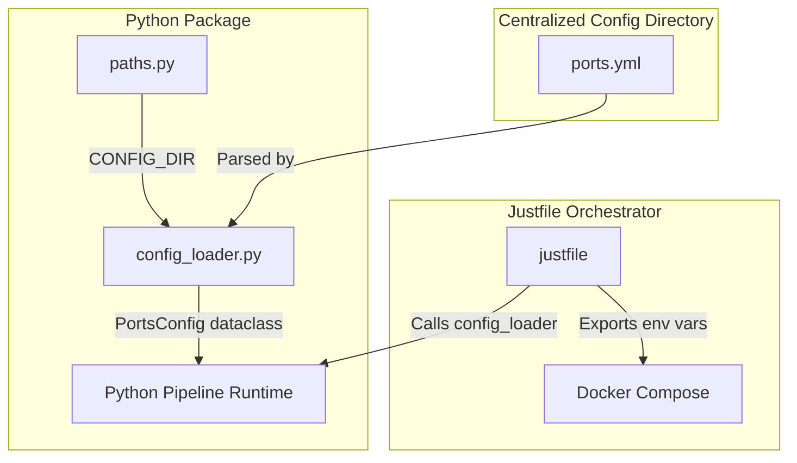
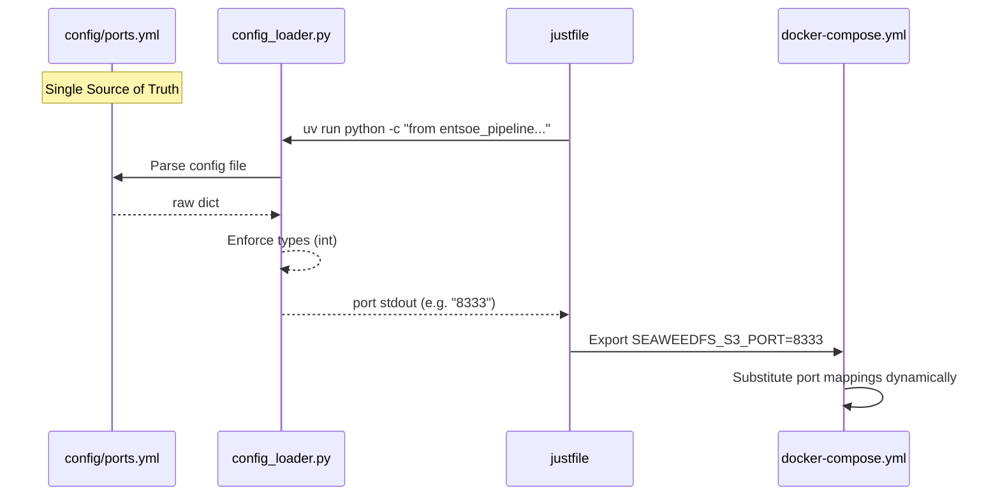

# ADR-001: Centralized YAML Configuration

## Metadata

**Status:** Accepted
**Version/Date:** v1.0 / 2026-05-19

## Title

Centralized YAML Configuration with Typed Python Loader and Justfile Bridge

## Description

Establish a centralized configuration architecture using structured YAML files under `config/`, parsed exclusively by a single type-safe Python loader (`config_loader.py`), with a lightweight `justfile` bridge to dynamically inject ports into Docker Compose at runtime.

## Context

### The Problem: Monolithic `.env` Wall of Text

A common pattern in data pipelines is to dump every single parameter into a monolithic, flat `.env` file at the project root. In real-world data platforms, this leads to massive configuration bloat that is extremely difficult to read, maintain, or secure:

```env
# Example of monolithic configuration anti-pattern in large data projects
PROJECT_NAME=omnichannel-commerce-data-platform
ENVIRONMENT=dev
LOG_LEVEL=INFO

# Local PostgreSQL warehouse / raw landing
POSTGRES_HOST=localhost
POSTGRES_PORT=5432
POSTGRES_DB=commerce_platform
POSTGRES_USER=commerce
POSTGRES_PASSWORD=commerce
POSTGRES_RAW_SCHEMA=raw
POSTGRES_STAGING_SCHEMA=staging
POSTGRES_MARTS_SCHEMA=marts

# Olist batch source
OLIST_DATASET_ID=olistbr/brazilian-ecommerce
OLIST_LANDING_PATH=storage/bronze/olist
KAGGLE_USERNAME=TODO_KAGGLE_USERNAME
KAGGLE_KEY=TODO_KAGGLE_KEY

# Retailrocket replay source
RETAILROCKET_DATASET_ID=retailrocket/ecommerce-dataset
RETAILROCKET_REPLAY_PATH=data/sample/streaming/retailrocket_events.jsonl
KAFKA_BOOTSTRAP_SERVERS=localhost:9092
KAFKA_TOPIC_RETAILROCKET_RAW=retailrocket.events.raw
KAFKA_TOPIC_RETAILROCKET_VIEW=retailrocket.events.view
KAFKA_TOPIC_RETAILROCKET_ADDTOCART=retailrocket.events.addtocart
KAFKA_TOPIC_RETAILROCKET_TRANSACTION=retailrocket.events.transaction
KAFKA_TOPIC_RETAILROCKET_DLQ=retailrocket.events.dlq
KAFKA_CONSUMER_GROUP=retailrocket-replay-local
KAFKA_TOPIC_PARTITIONS=6

# MongoDB raw JSON / event document store
MONGO_URI=mongodb://localhost:27017
MONGO_DATABASE=commerce_raw
MONGO_COLLECTION_RETAILROCKET=retailrocket_events_raw
MONGO_COLLECTION_OPEN_FOOD_FACTS_PRODUCTS=open_food_facts_products_raw
MONGO_COLLECTION_WEATHER=open_meteo_weather_raw
MONGO_COLLECTION_FX=frankfurter_fx_raw
MONGO_COLLECTION_BATCH_RUNS=batch_api_runs_raw

# MinIO object storage
MINIO_ENDPOINT=localhost:9000
MINIO_ACCESS_KEY=minio
MINIO_SECRET_KEY=minio123
MINIO_BUCKET_RAW=raw
MINIO_BUCKET_PROCESSED=processed

# Warehouse
WAREHOUSE_LOCAL_ENGINE=postgres
WAREHOUSE_BIGQUERY_PROJECT=TODO_PROJECT_ID
WAREHOUSE_BIGQUERY_LOCATION=US
WAREHOUSE_BIGQUERY_RAW_DATASET=commerce_raw
WAREHOUSE_BIGQUERY_STAGING_DATASET=commerce_staging
WAREHOUSE_BIGQUERY_MARTS_DATASET=commerce_marts
WAREHOUSE_BIGQUERY_PUBLIC_PROJECT=bigquery-public-data
WAREHOUSE_BIGQUERY_GA4_DATASET=ga4_obfuscated_sample_ecommerce
WAREHOUSE_BIGQUERY_THELOOK_DATASET=thelook_ecommerce
DBT_TARGET=dev

# Kestra
KESTRA_NAMESPACE=omnichannel.platform.dev
KESTRA_HOST=http://localhost:8080

# Spark
SPARK_MASTER_URL=local[*]
SPARK_APP_NAME=omnichannel-platform

# GCP / Terraform / dbt prod target
GCP_PROJECT_ID=TODO_PROJECT_ID
GCP_REGION=TODO_REGION
GCP_TERRAFORM_STATE_BUCKET=TODO_TF_STATE_BUCKET
GOOGLE_APPLICATION_CREDENTIALS=TODO_PATH_TO_SERVICE_ACCOUNT_JSON
GCP_SERVICE_ACCOUNT_JSON=TODO_INLINE_JSON_FOR_DBT_OR_CI

# Dashboard
DASHBOARD_PORT=8501
DASHBOARD_WAREHOUSE_SCHEMA=staging
DASHBOARD_RAW_SCHEMA=raw
API_BASE_URL=

# Cloud Run / dashboard image deployment
ARTIFACT_REPOSITORY_ID=omnichannel-platform
DASHBOARD_SERVICE_NAME=omnichannel-dashboard
DASHBOARD_CONTAINER_IMAGE=us-central1-docker.pkg.dev/TODO_PROJECT_ID/omnichannel-platform/dashboard:latest
```

This monolithic structure suffers from fatal architectural flaws:
1. **Zero Domain Separation:** Infrastructure parameters, catalog settings, and database configurations are thrown into one flat key-value namespace.
2. **No Type Safety:** Ports, partitions, memory strings, and boolean flags are parsed as raw strings, shifting casting responsibilities to application code.
3. **No Validation:** Typos in configuration keys fail silently during runtime environment lookup, causing delayed and opaque errors.
4. **Security Risks:** Public port parameters and non-sensitive setups sit right next to passwords and service account keys, forcing the entire file to be treated as high-risk and gitignored.
5. **DRY Violated:** Docker Compose, Python modules, and Shell utilities must each parse the file independently, duplicating key lookup logic.

### Our Solution: Structured, Domain-Split YAML Configuration

To solve this, we centralize our non-sensitive configurations into hierarchical YAML files categorized by domain within `config/` (e.g., `config/ports.yml`), parsed strictly in one location inside our library.

## Decision Drivers

- **Single Source of Truth (SSOT):** Centralize every public parameter so that it is never duplicated.
- **Maintainability & Readability:** Enable comments, self-documentation, and hierarchical structure.
- **Type Enforced Boundaries:** Enforce explicit type casting and defaults immediately at load time.
- **Strict Security Boundaries:** Keep public configurations in source control (YAML) and sensitive secrets isolated in gitignored `.env` files.
- **No Duplicate Shell Parsers:** Enable external consumers (Docker) to query values without writing custom YAML parsers in Bash.

## Alternatives

- **Alternative A: Monolithic `.env` File** — Store all environment variables and configuration options globally in a single `.env` file at the root.
  - *Pros:* Native integration with standard Docker and shell utilities.
  - *Cons:* Zero type safety, no hierarchical groupings, no comments, high security exposure (mixing public config with secrets).
- **Alternative B: Domain-Specific `.env` Files** — Split configurations into multiple files (e.g., `spark.env`, `ports.env`).
  - *Pros:* Better logical separation.
  - *Cons:* Still lacks structural hierarchy, no native validation, cluttered file listing.
- **Alternative C: Centralized YAML + Typed Loader (SELECTED)** — Store public configurations in structured YAML, parse them through an immutable Python dataclass loader, and use a `justfile` wrapper to inject parameters to external consumers.
  - *Pros:* Perfect structure, comments supported, explicit type enforcement, complete separation of secrets, fully DRY.
  - *Cons:* Small execution overhead (1-2s) when running Python from `just` commands.

### Decision Framework

| Model / Option | Readability & Organization (Weight: 35%) | Type Safety & Validation (Weight: 30%) | Security Isolation (Weight: 20%) | Integration DRYness (Weight: 15%) | Total Score | Decision |
| :--- | :---: | :---: | :---: | :---: | :---: | :--- |
| **Alternative C (Selected)** | 10/10 | 10/10 | 10/10 | 9/10 | **9.85** | ✅ **Selected** |
| Alternative B | 6/10 | 1/10 | 7/10 | 5/10 | **4.55** | Rejected |
| Alternative A | 2/10 | 0/10 | 2/10 | 6/10 | **2.00** | Rejected |

## Decision

We will adopt **Alternative C (Centralized YAML + Typed Loader)** to address the configuration scaling and DRY-violation issues. This involves using **domain-specific YAML files** in the `config/` directory, loaded via **typed, frozen `PortsConfig` dataclasses**, with a **`justfile` bridge** to dynamically populate ports for Docker Compose. This decision establishes the absolute single source of truth for the local Lakehouse.

## High-Level Architecture



## Related Requirements

### Functional Requirements

- **FR-1:** System must centralize infrastructure port mappings to prevent port conflicts across the local environment.
- **FR-2:** The platform must dynamically adapt to port overrides without rebuilding Docker images.

### Non-Functional Requirements

- **NFR-1 (Security):** Configuration files must not contain sensitive tokens or database passwords to prevent accidental commits to public repositories.
- **NFR-2 (Maintainability):** The configuration parsing logic must be fully isolated to a single entry-point module (`config_loader.py`).
- **NFR-3 (Extensibility):** New configuration domains must be addable by extending the YAML structure without altering existing runtime loaders.

### Performance Requirements

- **PR-1:** Configuration load times must be sub-second to prevent performance degradation during task initialization.
- **PR-2:** Memory footprint of configuration instances must be negligible using immutable dataclass representations.

### Integration Requirements

- **IR-1:** Docker Compose must dynamically inherit port configuration from the centralized YAML values at container startup.
- **IR-2:** Pre-commit hooks must validate YAML syntax to ensure only syntactically sound configuration is committed.

## Related Decisions

- **ADR-002** (Local Environment Configuration): Development environment setup with library-first tooling using `uv` for environment execution.

## Design

### Architecture Overview



### Implementation Details

**In `src/entsoe_pipeline/config/config_loader.py`:**

```python
"""Configuration loader module for the ENTSO-E data pipeline.

This module provides type-safe, immutable configuration objects by parsing
infrastructure YAML files and loading environment parameters.
"""

from dataclasses import dataclass
import yaml

from entsoe_pipeline import CONFIG_DIR


@dataclass(frozen=True)
class PortsConfig:
    """Immutable infrastructure ports configuration.
    
    Attributes:
        seaweedfs_s3 (int): Port for SeaweedFS S3-compatible API.
        iceberg_catalog (int): Port for Apache Iceberg REST Catalog.
    """
    seaweedfs_s3: int
    iceberg_catalog: int

    @classmethod
    def from_yaml(cls) -> "PortsConfig":
        """Loads and parses the ports configuration from ports.yml.

        Returns:
            PortsConfig: A type-safe configuration object.

        Raises:
            FileNotFoundError: If ports.yml is missing.
            yaml.YAMLError: If ports.yml contains invalid syntax.
        """
        ports_file = CONFIG_DIR / "ports.yml"
        
        with open(ports_file, "r", encoding="utf-8") as f:
            data = yaml.safe_load(f)
            
        ports_data = data.get("ports", {})
        
        # Enforce type casting and fallback values
        return cls(
            seaweedfs_s3=int(ports_data.get("seaweedfs_s3", 8333)),
            iceberg_catalog=int(ports_data.get("iceberg_catalog", 8181)),
        )
```

**In `src/entsoe_pipeline/config/paths.py`:**

```python
import os
from pathlib import Path


def find_project_root() -> Path:
    """Locates the project root directory deterministically."""
    if env_root := os.getenv("PROJECT_ROOT"):
        return Path(env_root)

    current_file = Path(__file__).resolve()
    for parent in current_file.parents:
        if (parent / ".project_root").exists():
            return parent

    return current_file.parents[3]


PROJECT_ROOT = find_project_root()
DATA_DIR = PROJECT_ROOT / ".data"
TESTS_DIR = PROJECT_ROOT / "tests"
ADR_DIR = PROJECT_ROOT / "docs" / "adr"
CONFIG_DIR = PROJECT_ROOT / "config"
```

**In `src/entsoe_pipeline/__init__.py`:**

```python
"""ENTSO-E Data Pipeline library."""

from entsoe_pipeline.config.paths import (
    ADR_DIR,
    DATA_DIR,
    PROJECT_ROOT,
    TESTS_DIR,
    CONFIG_DIR,
)

__all__ = ["ADR_DIR", "DATA_DIR", "PROJECT_ROOT", "TESTS_DIR", "CONFIG_DIR"]
```

### Configuration

**In `config/ports.yml`:**

```yaml
# Infrastructure ports configuration for local Lakehouse
ports:
  seaweedfs_s3: 8333
  iceberg_catalog: 8181
```

**In `justfile`:**

```just
seaweedfs_s3_port    := `uv run python -c "from entsoe_pipeline.config.config_loader import PortsConfig; print(PortsConfig.from_yaml().seaweedfs_s3)"`
iceberg_catalog_port := `uv run python -c "from entsoe_pipeline.config.config_loader import PortsConfig; print(PortsConfig.from_yaml().iceberg_catalog)"`

# Dynamically export variables so Docker Compose automatically inherits them
export SEAWEEDFS_S3_PORT    := seaweedfs_s3_port
export ICEBERG_CATALOG_PORT := iceberg_catalog_port

# Start the local Lakehouse services in the background
up:
    @echo "[JUST] Launching SeaweedFS"
    @echo "[JUST] S3 port: {{seaweedfs_s3_port}}"
    @echo "[JUST] Iceberg port: {{iceberg_catalog_port}}"
    docker compose -f docker/docker-compose.yml up -d
    @echo "[JUST] SeaweedFS is up and running"

# Stop and tear down all infrastructure containers
down:
    @echo "[JUST] Stopping SeaweedFS"
    docker compose -f docker/docker-compose.yml down
    @echo "[JUST] SeaweedFS stopped"
```

**In `docker/docker-compose.yml`:**

```yaml
services:
  seaweedfs:
    image: chrislusf/seaweedfs:latest
    container_name: seaweedfs
    restart: unless-stopped
    ports:
      - "9333:9333"   # HTTP master
      - "19333:19333" # gRPC master
      - "8080:8080"   # HTTP Volumes
      - "8888:8888"   # HTTP Filer
      - "18888:18888" # gRPC Filer
      - "${SEAWEEDFS_S3_PORT:-8333}:8333"     # S3 API
      - "${ICEBERG_CATALOG_PORT:-8181}:8181"   # Iceberg REST Catalog
    volumes:
      - /mnt/seaweed_data:/data
    command: 'server -dir=/data -s3'
```

## Testing

**In `tests/test_config.py`:**

```python
import pytest
from unittest.mock import mock_open, patch
from entsoe_pipeline.config.config_loader import PortsConfig


def test_ports_config_loading():
    """Verify that configuration values are correctly parsed and cast to integers."""
    mock_yaml = """
    ports:
      seaweedfs_s3: 9000
      iceberg_catalog: 9001
    """
    with patch("builtins.open", mock_open(read_data=mock_yaml)):
        config = PortsConfig.from_yaml()
        assert config.seaweedfs_s3 == 9000
        assert config.iceberg_catalog == 9001


def test_ports_config_fallbacks():
    """Verify that missing keys default safely to fallback ports."""
    mock_yaml = "ports: {}"
    with patch("builtins.open", mock_open(read_data=mock_yaml)):
        config = PortsConfig.from_yaml()
        assert config.seaweedfs_s3 == 8333
        assert config.iceberg_catalog == 8181
```

## Consequences

### Positive Outcomes

- **Absolute Single Source of Truth:** Changing a port configuration in `ports.yml` seamlessly propagates to both python pipeline environments and docker-compose containers.
- **Type Enforced Safety:** Ports are parsed and validated as integers instantly at load time.
- **Robust Domain Isolation:** Clear separation between git-monitored environments (YAML) and sensitive execution secrets (untracked `.env`).
- **Completely DRY Tooling:** Reuses the exact same Python dataclass parser via `justfile` instead of duplicated shell utilities.

### Negative Consequences / Trade-offs

- **Small Startup Overhead:** Each `justfile` invocation performs `uv run python` to fetch the variables, causing a 1-second delay.
- **Environment Dependency:** Requires the Python environment with dependencies (e.g. `PyYAML`) to be resolved locally to start containers via the `justfile`.

### Ongoing Maintenance & Considerations

- Ensure YAML syntax correctness via linting tools in CI to prevent parse failures.
- Track additional infrastructure configuration parameters by expanding domain YAML files (e.g., `spark.yml`, `duckdb.yml`) rather than `.env` keys.

### Dependencies

- **Infrastructure:** `Docker >= 20.10`, `just >= 1.20`
- **Data Frameworks:** `PyYAML >= 6.0`
- **Removed:** Any legacy shell-script parser or `.env` tracking for infrastructure ports.

## References

- [YAML serialization specifications](https://yaml.org/)
- [Twelve-Factor App guidelines for configuration management](https://12factor.net/config)
- [Just Command Runner specifications](https://github.com/casey/just)

## Changelog

- **v1.0 (2026-05-19)**: Initial accepted version.
