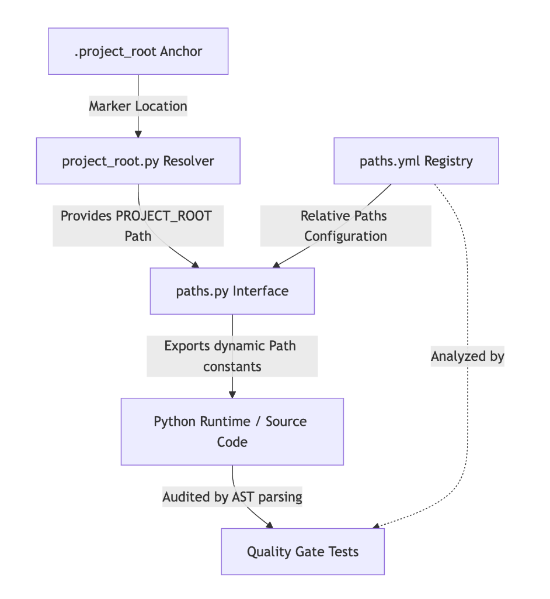
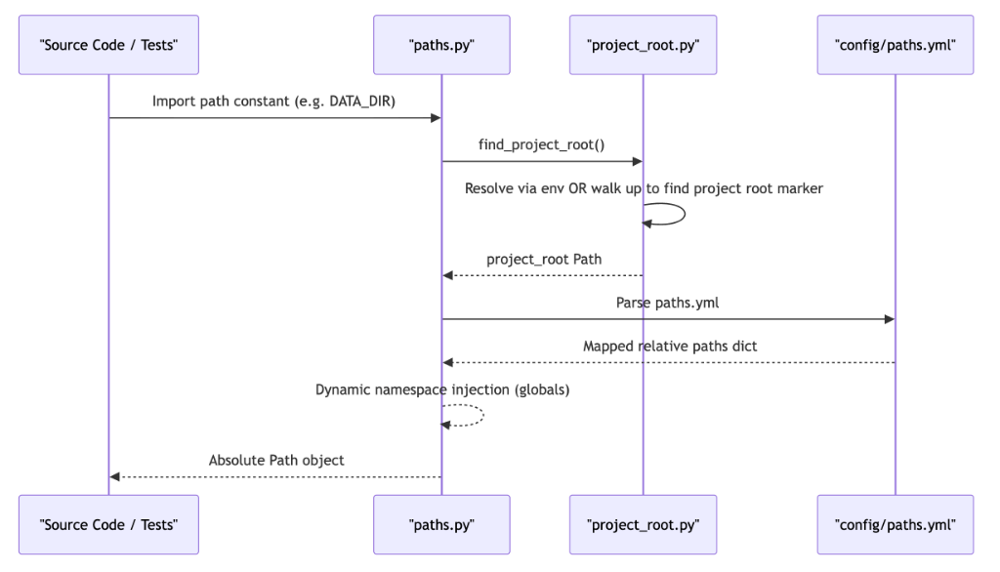

# ADR-002: Centralized Path SSOT Configuration

## Metadata

**Status:** Accepted
**Version/Date:** v1.0 / 2026-06-15

## Title

Centralized Path Single Source of Truth (SSOT) Configuration and AST Quality Gates

## Description

Establish a centralized path management architecture using `config/paths.yml` as the Single Source of Truth (SSOT), dynamically populated as `Path` objects in Python via `paths.py` relative to a deterministic `.project_root` anchor, and strictly enforced across the entire codebase using AST quality gate unit tests.

## Context

### The Problem: Hardcoded Relative Paths and Runtime Layout Fragility

A common anti-pattern in complex data engineering projects is to resolve paths in-place inside individual source modules. Typically, this looks like:

```python
# Fragile, hardcoded path resolution in application logic
from pathlib import Path
DATA_DIR = Path(__file__).resolve().parents[2] / "data" / "raw"
```

This ad-hoc approach has severe architectural flaws:
1. **Runtime Portability Failure:** When executing code under different runtimes (such as a local shell, inside Docker containers, within Apache Spark clusters, or triggered by an orchestrator like Airflow), the working directory and file hierarchy change. Hardcoded relative traversals (via multi-level parent directory traversal) break immediately when the execution context changes.
2. **Refactoring Nightmare:** If the project directory layout changes (e.g., relocating `fms_metadata/` or `.data/` folders), developers must manually search and update every single file that traverses or constructs paths.
3. **Untestable Code:** Mocking filesystem operations or redirecting paths to isolated temporary test directories is extremely difficult when paths are constructed locally inside target functions.
4. **Configuration Drift:** Having multiple files declare where configurations or data directories reside inevitably leads to silent drift, where different jobs expect data in slightly different locations.

### Our Solution: Centralized declarative path registry

To eliminate this fragility, we establish a centralized, declarative paths configuration registry. A base root directory is located deterministically using a file-based anchor (`.project_root`) and environment variable fallbacks, while all subdirectories and configuration files are registered in a single YAML file and exported dynamically.

## Decision Drivers

- **Single Source of Truth (SSOT):** Ensure every directory and file path in the workspace is defined in exactly one place.
- **Portability & Environment Agnosticism:** Guarantee path resolution works identically in development, CI, testing, and production (Docker/Spark).
- **Refactoring Ease:** Allow updating the entire directory hierarchy layout by changing a single line of configuration.
- **Strict Compliance:** Enforce that developers cannot bypass the SSOT by writing raw paths or in-place resolutions in the codebase.

## Alternatives

- **Alternative A: Hardcoded Relative Path Resolution** — Resolve paths in-place relative to module files (`__file__`) or current working directory (`os.getcwd()`).
  - *Pros:* Simple to write initially, zero dependencies.
  - *Cons:* Extremely fragile, breaks under Spark/Docker environments, impossible to easily refactor directories, hard to mock during tests.
- **Alternative B: Pure Environment Variable Configuration** — Inject all paths as environment variables via shell scripts or `.env` files.
  - *Pros:* Decoupled from codebase structure.
  - *Cons:* Clutters shell scripts, no static analysis validation, prone to typos, high configuration boilerplate.
- **Alternative C: Centralized Declarative Path Registry + AST Quality Gates (SELECTED)** — Declare paths in `config/paths.yml`, load them dynamically in Python, locate the project root using a `.project_root` anchor, and audit compliance with automated tests.
  - *Pros:* Single configuration file, absolute layout portability, clean type-safe `Path` imports, zero boilerplate, and 100% automated enforcement.
  - *Cons:* Dynamic module attribute generation requires fallback hooks (`__getattr__`) to satisfy static type checkers and IDE autocompletion tools.

### Decision Framework

| Model / Option | Portability & Robustness (Weight: 35%) | Maintainability & DRY (Weight: 30%) | Code Cleanliness (Weight: 20%) | Enforcement & Safety (Weight: 15%) | Total Score | Decision |
| :--- | :---: | :---: | :---: | :---: | :---: | :--- |
| **Alternative C (Selected)** | 10/10 | 10/10 | 9/10 | 10/10 | **9.80** | ✅ **Selected** |
| Alternative B | 7/10 | 6/10 | 5/10 | 3/10 | **5.70** | Rejected |
| Alternative A | 1/10 | 2/10 | 4/10 | 0/10 | **1.75** | Rejected |

## Decision

We will adopt **Alternative C (Centralized Declarative Path Registry + AST Quality Gates)**. 
- All paths are defined relative to the project root in `config/paths.yml`.
- The project root is resolved deterministically by `project_root.py` using the `.project_root` marker file or a `PROJECT_ROOT` environment override.
- The `paths.py` library interface loads the YAML file and dynamically populates its module namespace.
- We implement `test_paths_ssot_quality_gate.py` to statically audit all files, ensuring no raw path constructions or standard library resolutions bypass this registry.

## High-Level Architecture



## Related Requirements

### Functional Requirements

- **FR-1:** The system must locate the project root directory regardless of whether it is run from a terminal shell, a test runner, or inside containerized workloads.
- **FR-2:** The application must expose all configured paths as standard `pathlib.Path` objects to ensure cross-platform compatibility (Windows/Linux/macOS).

### Non-Functional Requirements

- **NFR-1 (Maintainability):** Modifying any directory path must only require changing the configuration in `config/paths.yml`.
- **NFR-2 (Testability):** All path variables must be mockable/overrideable during unit and integration test executions.
- **NFR-3 (Strict Verification):** The workspace layout registry compliance must be validated automatically as part of the test suite.

### Performance Requirements

- **PR-1:** Path resolution must execute in sub-millisecond times, caching references to avoid redundant lookup processes.

### Integration Requirements

- **IR-1:** The registry configuration must run transparently across CLI, local unit test runner sessions, Docker mounts, and PySpark workers.

## Related Decisions

- **ADR-001** (Centralized YAML Configuration): Establishes the standard configuration layout patterns under `config/` and `config_env/`.

## Design

### Architecture Overview



### Implementation Details

**In `src/entsoe_pipeline/config/core/project_root.py`:**

```python
"""Project root lookup implementation core module."""

from __future__ import annotations

import os
from pathlib import Path


def find_project_root() -> Path:
    """Locates the project root directory deterministically.

    Resolves the root folder using a three-tier fallback strategy:
    1. Prioritizes the 'PROJECT_ROOT' environment variable (useful in Docker/Airflow).
    2. Searches parent directories upward for the '.project_root' anchor file.
    3. Falls back to static parent calculation relative to this file's path.
    """
    if env_root := os.getenv("PROJECT_ROOT"):
        return Path(env_root)

    current_file = Path(__file__).resolve()
    for parent in current_file.parents:
        if (parent / ".project_root").exists():
            return parent

    return current_file.parents[4]
```

**In `src/entsoe_pipeline/config/paths.py`:**

```python
import typing
from entsoe_pipeline.config.core.project_root import find_project_root
from entsoe_pipeline.config.config_loader import load_paths_config

PROJECT_ROOT = find_project_root()
PATHS_YML = PROJECT_ROOT / "config" / "paths.yml"

# Load paths dynamically from the SSOT configuration file
_paths_data = load_paths_config(PROJECT_ROOT)

# Populate module namespace dynamically to establish SSOT exports
for _key, _rel_val in _paths_data.items():
    globals()[_key] = PROJECT_ROOT / _rel_val

# Expose constants for package-wide utilization
__all__ = ["PROJECT_ROOT"]
__all__.extend(list(_paths_data.keys()))


def __getattr__(name: str) -> typing.Any:
    """Allow dynamic attributes for static type checkers.

    This magic method ensures that IDEs, static linters, and type checkers (like
    mypy/pyright) recognize the dynamically populated path constants as valid
    module-level attributes, preventing false-positive lint warnings.
    """
    if name in __all__:
        return globals().get(name)
    raise AttributeError(f"module {__name__!r} has no attribute {name!r}")
```

### Configuration

**In `config/paths.yml`:**

```yaml
# ENTSO-E Metadata Pipeline Path Configurations
# This file is the Single Source of Truth (SSOT) for all workspace paths.
# All path values are declared relative to the PROJECT_ROOT directory.

DATA_DIR: ".data"
TESTS_DIR: "tests"
ADR_DIR: "docs/adr"
API_LIMITS_YML: "config/entsoe_api_limits.yml"
CONFIG_DIR: "config_env"
CONFIG_EXAMPLE_DIR: "config_env_example"
ENV_FILE: ".env"
FMS_METADATA_DIR: "fms_metadata"
OVERVIEW_YML: "fms_metadata/overview.yml"
OVERVIEW_TREE_YML: "fms_metadata/overview_tree.yml"
EXPORT_LOG_YML: "fms_metadata/export_log.yml"
LANDING_BUCKET_SCHEMA_YML: "config/entsoe_fms_folder_schema.yml"
```

## Testing

To ensure absolute adherence to our paths convention, we perform two layers of validation:

1. **Convention Compliance (Quality Gate):** We statically parse all `.py` files using regular expressions to audit code patterns. Any script attempting to resolve parent hierarchies using `Path(__file__)`, checking `os.getcwd()`, or instantiating hardcoded path strings pointing to workspace folder targets will fail this check.
2. **Symmetry and Parity Tests:** We ensure that every uppercase constant dynamically exported by `paths.py` matches the declarative list registered in `paths.yml`, preventing undocumented path constants.

**In `tests/test_paths_ssot_quality_gate.py`:**

```python
import re
from pathlib import Path
import pytest
from entsoe_pipeline import SRC_DIR, TESTS_DIR

EXEMPT_FILES = {"paths.py", "project_root.py", "test_paths.py", "test_paths_ssot_quality_gate.py"}

def get_python_files():
    # Recursively yield all source and test modules, excluding EXEMPT_FILES
    return [p for p in SRC_DIR.rglob("*.py") if p.name not in EXEMPT_FILES]

@pytest.mark.parametrize("file_path", get_python_files())
def test_no_raw_paths_or_parent_traversal(file_path: Path):
    """Quality gate verifying that modules import path constants from paths.py."""
    content = file_path.read_text(encoding="utf-8")
    
    violations = []
    
    # Audit for in-place relative traverses
    if re.search(r"Path\(\s*__file__\s*\)", content):
        violations.append("Found reference to Path(__file__). Centralize path in paths.py")
        
    if re.search(r"PROJECT_ROOT\s*/", content):
        violations.append("Direct raw path concatenation using PROJECT_ROOT. Export from paths.py")
        
    if re.search(r'Path\(\s*["\'](?:\.env|\.data|config_env)["\']\s*\)', content):
        violations.append("Direct instantiation of hardcoded repository paths. Import from paths.py")

    assert not violations, f"Path violations found in {file_path.name}:\n" + "\n".join(violations)
```

## Consequences

### Positive Outcomes

- **Absolute Portability:** Running tests or pipeline runs works natively across local laptops, staging setups, Docker environments, and PySpark clusters without path failures.
- **Easy Maintenance:** Moving a directory layout requires changing exactly one YAML line, rather than editing dozens of hardcoded paths.
- **Improved Testability:** Unit tests can safely patch or redirect specific directories (like the landing bucket schema path) by simply altering `paths.LANDING_BUCKET_SCHEMA_YML` without complex filesystem mocking.
- **No Hardcoding Drift:** Ensures new developers cannot introduce ad-hoc layouts, enforcing clean development hygiene.

### Negative Consequences / Trade-offs

- **Static Analyzer Workarounds:** Dynamic namespace injection using `globals()` bypasses standard static code compilation checks. To ensure IDE autocompletions and linters still recognize the constants, we had to introduce `__getattr__` fallback hooks and declare them in package exports.
- **Overhead in Setup:** Adding a new directory path requires adding it to both `paths.yml` and updating the coverage test dictionary in `test_paths.py`.

### Ongoing Maintenance & Considerations

- New paths must always be defined in `config/paths.yml` and mirrored in the `EXPECTED_PATHS` mapping inside `tests/test_paths.py`.
- Any exceptions/exemptions to the quality gate (such as utility scripts or path-specific test suites) must be explicitly listed in the `EXEMPT_FILES` set in `tests/test_paths_ssot_quality_gate.py`.

### Dependencies

- **Infrastructure:** `.project_root` empty anchor file located at the project root directory.
- **Libraries:** `pathlib` (Python Standard Library), `ruamel.yaml` / `yaml` (Parser).

## References

- [ADR-001: Centralized YAML Configuration](docs/adr/ADR-001-centralized-yaml-configuration.md)
- [Python PEP 562 -- Module __getattr__ and __dir__](https://peps.python.org/pep-0562/)
- [Twelve-Factor App guidelines on configuration and path portability](https://12factor.net/config)

## Changelog

- **v1.0 (2026-06-15)**: Initial accepted version detailing centralized dynamic YAML paths configuration and AST quality gates.
