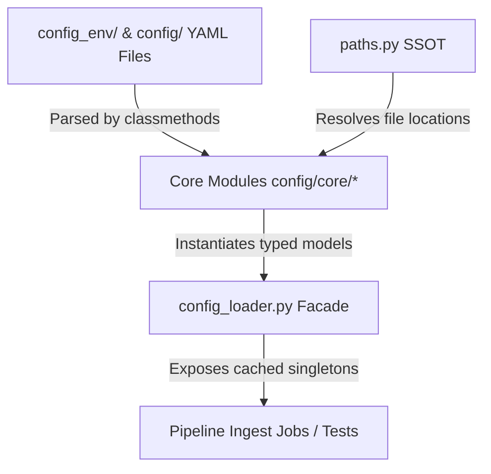
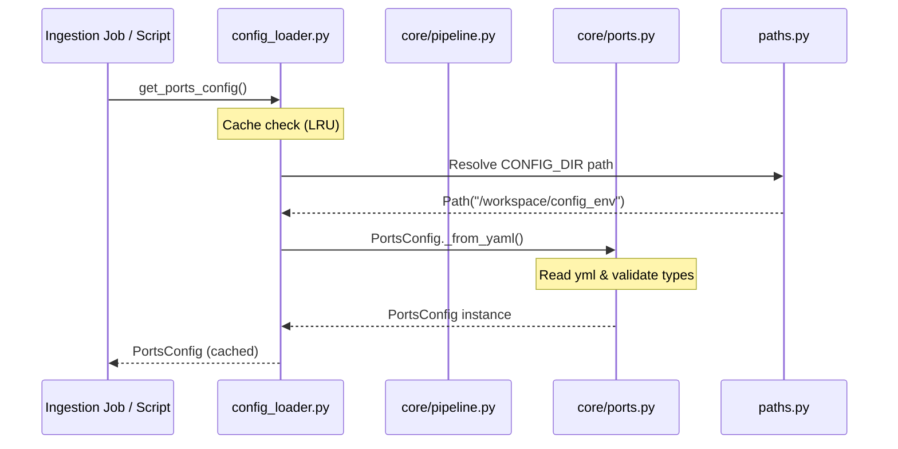

# ADR-003: Centralized Config Loader Facade and Typed Core Package Design

## Metadata

**Status:** Accepted
**Version/Date:** v1.0 / 2026-06-15

## Title

Centralized Config Loader Public Facade and Typed Core Model Separation

## Description

Establish a type-safe, modular configuration loading architecture utilizing `src/entsoe_pipeline/config/config_loader.py` as a pure public facade (API) that delegates all logic to specialized, immutable dataclasses defined within the `core/` package, resolving configurations dynamically relative to our path registry without hardcoding directory locations.

## Context

### The Problem: Monolithic configuration loading and path assumptions

A metadata-driven pipeline depends on numerous configuration inputs:
- Infrastructure ports (`ports.yml`)
- Storage buckets (`bucket.yml`)
- Target AWS regions (`region.yml`)
- System hostnames (`hosts.yml`)
- Keycloak credentials (`enviroment.yml`)
- Rate limiting specifications (`entsoe_api_limits.yml`)
- Data classifications rules (`entsoe-classifier.yml`)

If each ingest job or helper script parses these YAML files directly using custom code and hardcoded relative paths, it results in:
1. **High Fragility:** Moving folders or modifying schema structure breaks multiple files silently.
2. **Boilerplate Duplication:** Identical loading, validation, and parsing logic is copied across jobs.
3. **No Cache Optimization:** Reading configuration files repeatedly from disk during run loops hurts pipeline performance.
4. **Poor IDE Experience:** Accessing configuration properties as dynamic dictionaries (such as `config.ports.s3_compatible`) prevents IDE autocompletion, static type checking, and compile-time error detection.

### Our Solution: Separated core parsers and public loader API

We decouple the configuration schema definitions from the retrieval API. Domain schemas are declared as typed, frozen Python dataclasses in `config/core/`. A clean, cached public loader interface (`config_loader.py`) acts as the exclusive gateway for all consumer code.

## Decision Drivers

- **Facade pattern encapsulation:** Hide configuration parsing and YAML mapping logic behind a clean, unified public interface.
- **Strict type validation:** Enforce types, mandatory parameters, and sensible fallbacks on module load.
- **Portability & Agnosticism:** Never hardcode directory targets (like `fms_metadata/`, `config_env/`, or `config/`) in code; resolve them exclusively using the `paths.py` registry (SSOT).
- **Automated quality gates:** Prevent configuration structure or metadata descriptions from drifting out of sync.

## Alternatives

- **Alternative A: In-Place Dictionary Loading** — Load raw YAML files dynamically into dict objects whenever a script needs them.
  - *Pros:* Quick to write, zero class boilerplate.
  - *Cons:* No type safety, no property autocompletion, duplicative path traversals, prone to key errors.
- **Alternative B: Monolithic Config Class** — Declare a single massive configuration class that loads all YAML directories at once.
  - *Pros:* Simpler file layout (one class).
  - *Cons:* Poor separation of concerns, violates single-responsibility principle, harder to test individual sub-systems.
- **Alternative C: Facade Loader + Typed Core Package (SELECTED)** — Isolate domains into separate dataclass files within `config/core/` and expose them exclusively through cached accessors in `config_loader.py`.
  - *Pros:* Maximum modularity, clean public API, cached memory footprints, 100% type safety.
  - *Cons:* Multiple file creation overhead.

### Decision Framework

| Model / Option | Modularity & DRY (Weight: 35%) | Type Safety & Cache (Weight: 30%) | Test Isolation (Weight: 20%) | Code Cleanliness (Weight: 15%) | Total Score | Decision |
| :--- | :---: | :---: | :---: | :---: | :---: | :--- |
| **Alternative C (Selected)** | 10/10 | 10/10 | 10/10 | 9/10 | **9.85** | ✅ **Selected** |
| Alternative B | 6/10 | 8/10 | 6/10 | 7/10 | **6.75** | Rejected |
| Alternative A | 2/10 | 1/10 | 2/10 | 3/10 | **1.85** | Rejected |

## Decision

We will adopt **Alternative C (Facade Loader + Typed Core Package)**.
- Public config API is defined exclusively in `src/entsoe_pipeline/config/config_loader.py`.
- Facade delegates all parsing and schemas to individual files in `src/entsoe_pipeline/config/core/`.
- No paths are hardcoded; all configuration directories (`config_env/`, `config/`, `fms_metadata/`) are resolved via `paths.py`.

## High-Level Architecture



## Related Requirements

### Functional Requirements

- **FR-1:** All configuration options must be accessible via type-safe attributes rather than string dictionary lookups.
- **FR-2:** The configuration system must cache loaded configs in memory to avoid repetitive disk I/O.

### Non-Functional Requirements

- **NFR-1 (Maintainability):** The facade script must remain thin and free of direct class schemas, acting purely as an import bridge.
- **NFR-2 (Robustness):** All parameters must fall back to safe default ports or options if configuration files are partially empty.

### Performance Requirements

- **PR-1:** Loading configurations from cache must execute in sub-microsecond timescales to avoid degrading performance during tight iteration loops.

### Integration Requirements

- **IR-1:** Configuration parameters must expose native representations compatible with environment configurations, Docker daemon network constraints, and AWS service specifications.

## Related Decisions

- **ADR-001** (Centralized YAML Configuration): Establishes the folder structure split between `config/` and `config_env/`.
- **ADR-002** (Centralized Path SSOT Configuration): Resolves configuration paths dynamically using `paths.py` relative to `.project_root`.

## Design

### Architecture Overview



### Implementation Details

The core logic and type schemas reside in the following modules:
1. `src/entsoe_pipeline/config/core/buckets.py`: Declares `BucketsConfig` for S3 bucket namespace mapping.
2. `src/entsoe_pipeline/config/core/classifier.py`: Declares `ClassifierConfig` for FMS catalog folder indexing rules.
3. `src/entsoe_pipeline/config/core/hosts.py`: Declares `HostsConfig` mapping hostnames of internal containers.
4. `src/entsoe_pipeline/config/core/limits.py`: Declares `RateLimitsConfig` defining throttle constraints.
5. `src/entsoe_pipeline/config/core/ports.py`: Declares `PortsConfig` defining TCP network mapping targets.
6. `src/entsoe_pipeline/config/core/region.py`: Declares `RegionConfig` for geographical cloud target identification.
7. `src/entsoe_pipeline/config/core/pipeline.py`: Composes all sub-configs into a single `PipelineConfig` master model.

**Sample Facade Accessor - in `src/entsoe_pipeline/config/config_loader.py`:**

```python
from functools import cache
from entsoe_pipeline.config.core import PortsConfig

@cache
def get_ports_config() -> PortsConfig:
    """Loads and returns the cached PortsConfig singleton."""
    return get_config().ports
```

### Configuration

**Example configuration structure inside `config_env/my_entsoe_domains.yml`:**

```yaml
# Schema mapping for our active domains configuration
active_mode: "Default"
config_name: "statistical_must_haves"
```

## Testing

We enforce the config loader design and metadata completeness using three specialized testing strategies:

1. **Facade Integrity Tests (`tests/test_config_loader.py`):**
   Verifies that `config_loader.py` contains **zero direct class definitions** (all class models must be imported from the `core/` package). It also asserts the correctness of defaults, caches, and missing file error raises.
   
2. **Metadata Specification Audit (`tests/test_config_metadata.py`):**
   Validates that all example/template configuration files (e.g., in `config_env_example/`) contain a `metadata` section documenting every parameter. It enforces that:
   - Descriptions are present and comprehensive (>= 150 characters).
   - Valid data types (`string`, `integer`, `object`) are declared.
   - Default values match their declared types.
   
3. **Folder Schema Mirror Audit (`tests/test_config_mirror.py`):**
   Enforces that the keys and structures in `config_env_example/` match the developers' local configuration directory `config_env/` exactly. This prevents developers from introducing new properties locally without documenting them in the public template files.

## Consequences

### Positive Outcomes

- **Clean API Contract:** Ingestion scripts simply call `get_config()` and read attributes without worrying about relative paths, filesystem parsing, or dict keys.
- **Robust Verification:** Developers are forced to fully document and match template configuration changes, preventing broken onboarding setups.
- **Optimized Execution:** Repetitive config queries return cached objects in sub-microseconds without hitting the filesystem.

### Negative Consequences / Trade-offs

- **File Proliferation:** Adding a single configuration parameter domain requires creating a YAML configuration file, a core class model file, a facade wrapper function, and updating mirror tests.

### Ongoing Maintenance & Considerations

- Any new configurations added to the repository must be accompanied by corresponding template mappings in `config_env_example/` to satisfy the schema mirror audit tests.
- When updating schema properties, their types must be mirrored inside `config/core/` package schemas.

### Dependencies

- **Libraries:** `pydantic` or typed dataclasses with `functools.cache` for runtime representation and memoization.
- **Configurations:** The path system defined in `paths.py` (ADR-002) is required to locate the configuration folder targets.

## References

- [Twelve-Factor App guidelines on configuration segregation](https://12factor.net/config)
- [Design Patterns: Facade Structural Pattern](https://en.wikipedia.org/wiki/Facade_pattern)

## Changelog

- **v1.0 (2026-06-15)**: Initial accepted version detailing centralized dynamic config loader facade design.
