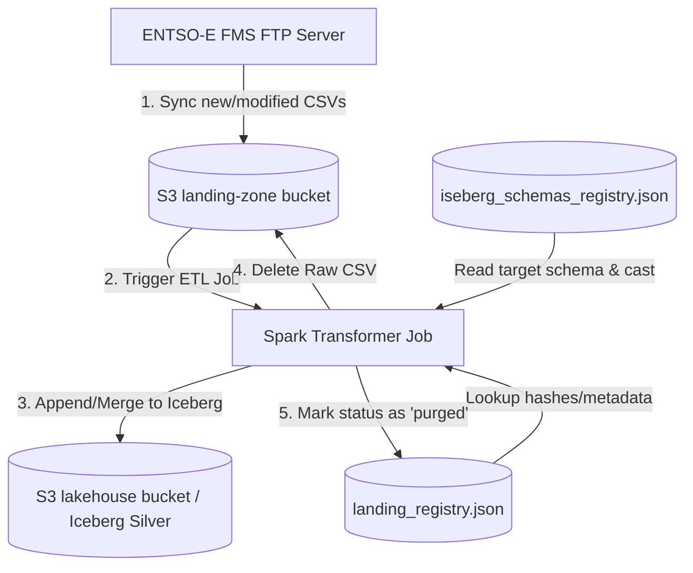

# ADR-004: Ephemeral Landing Zone with Event-Driven Staging Integration

## Metadata

**Status:** Proposed
**Version/Date:** v1.0 / 2026-06-29

## Title

Ephemeral Landing Zone with Event-Driven Staging Integration

## Description

Establish an ephemeral landing zone architecture for the ENTSO-E data pipeline, where raw CSV files are immediately processed into Apache Iceberg tables in the Staging (Silver) layer and subsequently purged from S3, keeping only the landing registry as the historic metadata passport of raw ingestions.

## Context

1. **Storage Optimization:** Raw CSV files downloaded from the ENTSO-E FMS API are large (often 50+ MB per month/endpoint). Storing them permanently in S3 is redundant and results in massive storage costs and cluster disk usage.
2. **Silver Layer Primacy:** Downstream analysis, Spark processing, and querying are executed solely on the Silver (Staging) Iceberg tables, which store the data in highly compressed Parquet format.
3. **Auditability ("Data Passport"):** Even if raw CSV files are deleted, the pipeline requires an audit trail to track what files were downloaded, when they were ingested, and their hashes (to prevent duplicate downloads unless the remote file changes). The local `landing_registry.json` file serves as this historical metadata database.

## Decision Drivers

- Reduce object storage consumption in SeaweedFS.
- Maintain transactional consistency and historic traceability.
- Automate downstream pipeline triggering on file arrivals.

## Alternatives

- **Alternative A (Persistent Raw Files):** Retain all raw CSV files in S3. This consumes large amounts of storage and offers no architectural benefit.
- **Alternative B (No Registry):** Purge raw files without updating a registry, losing all synchronization history and duplicate prevention logic.

### Decision Framework

| Model / Option | Solution Leverage (Weight: 30%) | Application Value (Weight: 40%) | Maintenance (Weight: 30%) | Total Score | Decision |
|---|---|---|---|---|---|
| **Ephemeral Landing (Selected)** | 9/10 | 9/10 | 8/10 | **8.7** | ✅ **Selected** |
| Persistent Raw Files | 4/10 | 5/10 | 6/10 | 5.0 | Rejected |

## Decision

We will adopt an **Ephemeral Landing with Event-Driven Staging** pattern. Raw CSV files in the `landing-zone` bucket act as a temporary buffer and are purged from S3 upon successful load into Iceberg, with metadata persisted to the `landing_registry.json`.

## High-Level Architecture



## Related Requirements

### Functional Requirements

- **FR-1:** The pipeline must ingest new and modified files idempotently using xxHash comparison.
- **FR-2:** The pipeline must purge raw files after successful database load to minimize storage.

### Non-Functional Requirements

- **NFR-1:** S3 Landing Zone storage utilization must remain minimal.
- **NFR-2:** `landing_registry.json` must act as a complete, read-only historic passport of all ingested files.

### Performance Requirements

- **PR-1:** Spark read and write operations must complete within 2 minutes per monthly CSV chunk.
- **PR-2:** Memory footprints for the Spark execution environment must remain under 4GB local executor bounds.

### Integration Requirements

- **IR-1:** The sync engine must dynamically write schemas using PySpark REST catalog connector endpoints.
- **IR-2:** Kestra must trigger the sync and transform flows based on file state events.

## Related Decisions

- **ADR-002** (Centralized Path SSOT): All registry and schema JSON files conform to paths resolved dynamically by `paths.yml`.

## Design

### Architecture Overview

The system divides ingestion into a lightweight FTP sync step and a transactional Spark-based Silver transformation step.

### Implementation Details

1. **FTP Ingestion:** Sync script downloads files to `landing-zone/`.
2. **Spark Transformation:** Spark reads the raw CSV, applies formatting and overrides from `schema_overrides.yml`, writes to Iceberg, and executes S3 deletion.

### Configuration

The purge behavior is managed via `config_env/lakehouse.yml`:
```yaml
lakehouse:
  purge_raw_after_transform: true
```

## Testing

1. **Unit Tests:** Verify schema parsing and overrides application in isolation.
2. **Integration Tests:** Execute mock sync runs, verify table appends in Iceberg Catalog, and check that files are purged from the landing zone mock bucket.

## Consequences

### Positive Outcomes

- Significant storage savings.
- Declarative schemas.
- Clean database state.

### Negative Consequences / Trade-offs

- Re-ingesting raw files requires re-downloading them from FMS.
- Spark REST Catalog must remain active for all transform jobs.

### Ongoing Maintenance & Considerations

- Schema overrides must be updated in `schema_overrides.yml` if column names change.

### Dependencies

- PySpark 4.1.1 runtime bundle.
- SeaweedFS S3-compatible endpoints.

## References

- ENTSO-E FMS Integration Specification.
- Apache Iceberg Spark Integration Documentation.

## Changelog

- **v1.0 (2026-06-29):** Initial proposed draft.
