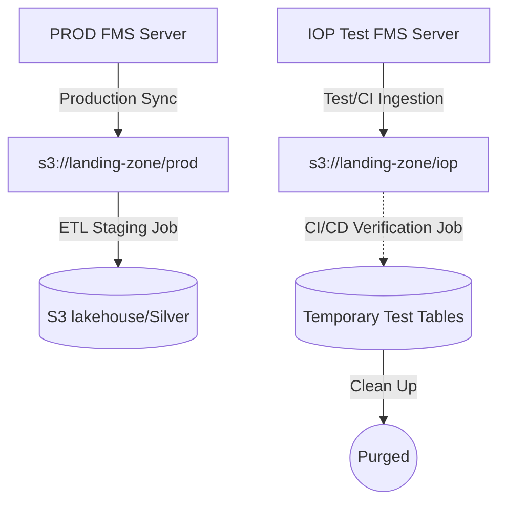

# ADR-006: Isolation of IOP Test Environment and FMS Credentials

## Metadata

**Status:** Proposed
**Version/Date:** v1.0 / 2026-06-29

## Title

Isolation of IOP Test Environment and FMS Credentials

## Description

Define the architectural boundary between the ENTSO-E Integration Test Platform (IOP) and the Production (PROD) platforms, limiting the storage of IOP test data to temporary validation buffers and isolating developer/test credentials.

## Context

1. **Analytical Quality of Data:** The ENTSO-E IOP platform is a sandbox environment for data providers to test their publishing pipelines. The files published in IOP contain mock data, synthetic values, and fragmented timelines. Loading this data into the staging (Silver) lakehouse layer creates data pollution and distorts analytical results.
2. **API and FMS Rate Limits:** The ENTSO-E servers enforce strict rate limiting (400 requests/minute). Running automated pipeline tests or local developer runs against the PROD servers risk exceeding these limits, causing service blocks for production jobs.
3. **CI/CD Validation Safety:** Developers require a sandbox environment to test synchronization scripts, parser logic, and Iceberg table writes in CI/CD pipelines. This must run without impacting production storage or credentials.

## Decision Drivers

- Isolate production data from synthetic test data.
- Prevent API rate-limit starvation on production FMS servers.
- Enable robust integration testing in CI/CD pipelines.

## Alternatives

- **Alternative A (Single Unified Environment):** Mix IOP and PROD datasets in the same S3 landing bucket and write them into unified database tables. This results in heavy data pollution.
- **Alternative B (Dual Staging Buckets):** Deploy separate S3 lakehouse buckets for test and production runs, and load IOP data permanently. This increases cloud costs for zero analytical value.
- **Alternative C (IOP as CI/CD Test Sandbox):** Store IOP files under an isolated directory structure in the landing zone bucket, skip loading IOP data to the persistent staging layer, and use IOP credentials exclusively for validation tests.

### Decision Framework

| Model / Option | Solution Leverage (Weight: 30%) | Application Value (Weight: 40%) | Maintenance (Weight: 30%) | Total Score | Decision |
|---|---|---|---|---|---|
| **IOP as CI/CD Test Sandbox (Selected)** | 9/10 | 9/10 | 8/10 | **8.7** | ✅ **Selected** |
| Dual Staging Buckets | 5/10 | 4/10 | 6/10 | 4.9 | Rejected |
| Single Unified Environment | 2/10 | 2/10 | 5/10 | 2.9 | Rejected |

## Decision

We will adopt the **IOP as CI/CD Test Sandbox** approach.
1. The landing zone bucket retains both `iop/` and `prod/` folder paths for temporary raw downloads to support local debugging.
2. Staging jobs will only load files from the `prod/` raw folders into the persistent `lakehouse` catalog.
3. Automated integration tests and CI/CD pipelines will execute using IOP credentials to test full-cycle FMS downloads and staging transformations safely.

## High-Level Architecture



## Related Requirements

### Functional Requirements

- **FR-1:** The sync job must dynamically point to either the IOP or PROD FMS servers based on the active environment configuration.
- **FR-2:** Staging transformation pipelines must filter out IOP data from production tables.

### Non-Functional Requirements

- **NFR-1:** **(Data Quality)** Staging lakehouse tables must remain free of synthetic or test records.
- **NFR-2:** **(Security)** Production credentials must never be exposed or used during automated test suites.

### Performance Requirements

- **PR-1:** CI/CD runs executing against the IOP server must respect the 400 requests/minute API limit.

### Integration Requirements

- **IR-1:** The test runner must resolve active credentials dynamically using environment resolvers.

## Related Decisions

- **ADR-001** (Centralized YAML Config): Environment URLs and credential keys are resolved from env configurations.
- **ADR-004** (Ephemeral Landing Zone): Raw CSV files are cleared from the S3 landing-zone bucket after staging.

## Design

### Architecture Overview

The system isolates environment endpoints using `config_env/enviroment.yml`, which defines base URLs and token servers for IOP and PROD.

### Implementation Details

In `src/entsoe_pipeline/config/env_resolver.py`:
```python
def resolve_active_environment() -> str:
    # Dynamically reads the active environment (IOP or PROD)
```

In `jobs/staging/landing/prepare_landing_ingestion.py`:
```python
active_env = resolve_active_environment()
# executes crawler using active_env configurations
```

### Configuration

In `config_env/enviroment.yml`:
```yaml
active_environment: "PROD"
environments:
  IOP:
    base_url: "https://fms.tp-iop.entsoe.eu/"
  PROD:
    base_url: "https://fms.tp.entsoe.eu/"
```

## Testing

In `tests/test_io_operations.py`:
```python
def test_iop_sync_workflow(monkeypatch):
    """Verify that setting the environment to IOP successfully routes requests."""
    monkeypatch.setenv("ENV", "IOP")
    # Assertions for IOP FMS host routing
```

## Consequences

### Positive Outcomes

- Complete isolation of production analytics from synthetic test data.
- Elimination of rate-limiting conflicts on production FMS servers during developer activity.
- Secure, reproducible CI/CD integration testing.

### Negative Consequences / Trade-offs

- Requires managing two sets of client credentials (IOP and PROD).
- Synthetic data in IOP may occasionally drift from production formats, requiring format adaptations in tests.

### Ongoing Maintenance & Considerations

- Monitor ENTSO-E platform change announcements for schema changes in both environments.
- Rotate FMS client tokens on a scheduled basis.

### Dependencies

- **Infrastructure**: S3-compatible SeaweedFS, ENTSO-E FMS API endpoints.

## References

- [ENTSO-E Transparency Platform Guide](https://transparency.entsoe.eu/)
- [ADR-001: Centralized Configuration](docs/adr/ADR-001-centralized-yaml-configuration.md)
- [ADR-004: Ephemeral Landing Zone](docs/adr/ADR-004-ephemeral-landing-event-driven-staging.md)

## Changelog

- **v1.0 (2026-06-29)**: Initial draft defining the IOP environment isolation strategy.
