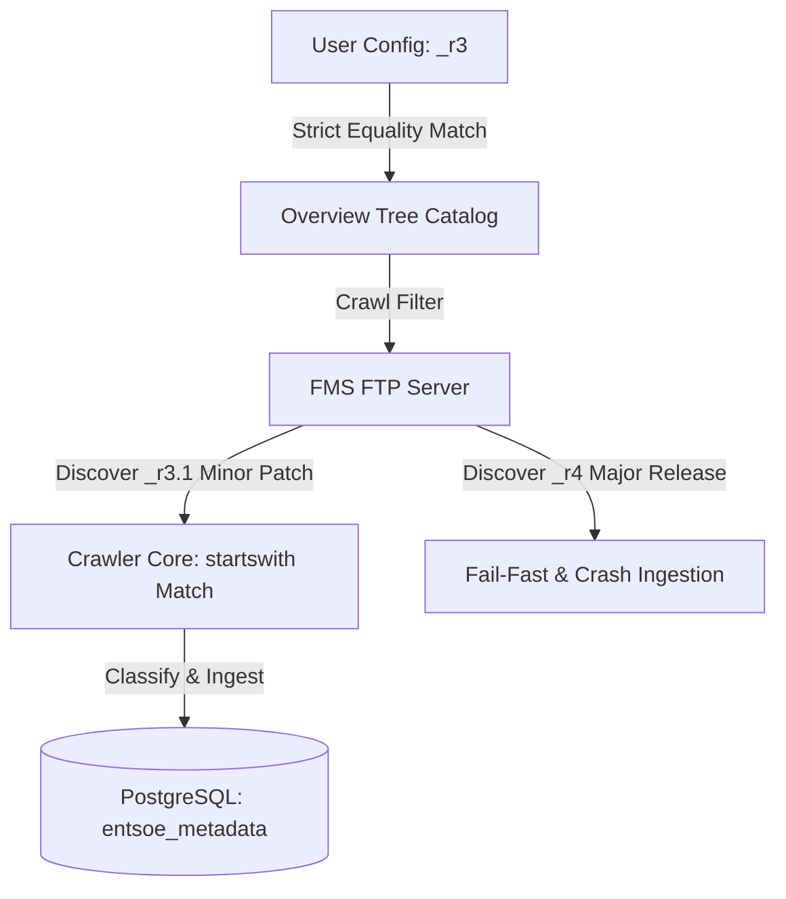

# ADR-009: FMS Metadata Catalog Matching and Contracts

## Metadata

**Status:** Accepted
**Version/Date:** v1.0 / 2026-07-01

## Title

FMS Metadata Catalog Matching and Contracts

## Description

Enforce exact folder suffix matching (e.g. `_r3`) in user-level configuration templates as a strict Data Contract, while retaining prefix-based `startswith()` matching in the crawling discovery core to tolerate minor revisions seamlessly.

## Context

In our metadata pipeline architecture, folders on the ENTSO-E FMS FTP server are physically revisioned with suffixes indicating major data schema or business logic updates (e.g. `/TP_export/ActualTotalLoad_6.1.A_r3/`). The logical names for these items in documentation and the Zendesk help page omit this suffix. 

When designing user-level active domain checklists (like `my_entsoe_default.yml`), there is a temptation to abstract these suffixes away to make the configurations look cleaner. However, doing so leaks abstract definitions into physical execution boundaries. 

If the pipeline automatically resolved and swallowed major revision changes (e.g. automatically matching a newly released `_r4` directory via prefix matching), it would lead to Silent Data Corruption:
- Incompatible schema modifications or physical metric changes (e.g. units shifts, column splits) would be written directly into the S3 landing Bronze layer.
- Downstream tables using formats like Apache Iceberg might tolerate the schema changes due to physical schema evolution, but the underlying business aggregations would silently output corrupt or incomplete results.
- Additionally, prefix collisions exist (e.g. `OfferedTransferCapacitiesContinuous_11.1_r3` vs `OfferedTransferCapacitiesContinuousEvolution_11.1_r3`), which makes loose matching unsafe.

## Decision Drivers

- **Data Quality & Reliability:** Prevent Silent Data Corruption in analytical tables by failing fast on breaking schema revisions.
- **Explicit Data Contracts:** Ensure user configuration files explicitly state the target directory schema revision being consumed.
- **Fail-Safe Integrity:** Do not swallow major API/FTP breaking structure changes automatically.
- **Collision Avoidance:** Prevent prefix matching collisons on folders with similar root names.

## Alternatives

- **A: Dynamic Prefix Matching via startswith() in User Configs**
  - *Pros:* Simpler, cleaner configs without `_r3` suffixes.
  - *Cons:* Silent data corruption if `_r4` is released; namespace collisions between continuous and continuous evolution domains.
- **B: Strict Equality Mapping (==) Everywhere**
  - *Pros:* Fully strict contract.
  - *Cons:* Extremely fragile. If ENTSO-E releases a minor patch folder like `_r3.1` (which has the same schema but minor changes), the crawler will crash, requiring manual user intervention and config edits for non-breaking changes.

### Decision Framework

| Model / Option         | Solution Leverage (Weight: 25%) | Concurrency & ACID (Weight: 20%) | Data Reliability (Weight: 35%) | Infrastructure Complexity (Weight: 20%) | Total Score | Decision      |
| ---------------------- | ------------------------------- | -------------------------------- | ------------------------------ | --------------------------------------- | ----------- | ------------- |
| **Hybrid Contracts**   | 9                               | 10                               | 10                             | 9                                       | **9.55**    | ✅ **Selected** |
| Dynamic Matching       | 8                               | 9                                | 4                              | 9                                       | **7.20**    | Rejected      |
| Strict Equality        | 7                               | 9                                | 9                              | 9                                       | **8.50**    | Rejected      |

## Decision

We will adopt the **Hybrid Contracts** pattern. We will explicitly declare the target physical folder suffixes (e.g. `_r3`) in both the Single Source of Truth classifier (`entsoe_domains_classifier.yml`) and the user-level configuration templates. 

We will verify active folders by comparing the configured template values with the discovered FTP folders using strict string equality. Concurrently, the crawling classifier engine will use prefix-based `startswith()` matching to assign FTP directories to domains, enabling the pipeline to tolerate minor revision updates (e.g. `_r3.1`) dynamically while failing fast on major changes (e.g. `_r4`).

## High-Level Architecture



## Related Requirements

### Functional Requirements

- **FR-1:** The system must restrict file downloading only to the exact revision directories specified in the active configuration.
- **FR-2:** The metadata crawler must successfully classify FMS directories into domains.

### Non-Functional Requirements

- **NFR-1:** **(Data Reliability)** The pipeline must prevent silent data ingestion errors during upstream FMS schema updates.
- **NFR-2:** **(Maintainability)** All folder contracts must be centrally defined inside configuration files.

### Performance Requirements

- **PR-1:** Configuration matching latency must not exceed 50 milliseconds.

### Integration Requirements

- **IR-1:** The system must natively tolerate minor schema updates supported by the Apache Iceberg storage layout.

## Related Decisions

- **ADR-008** (Migration of FMS Metadata Catalog from YAML to PostgreSQL): The relational metadata tables will store the `folder_path` attribute containing the physical suffix.
- **ADR-007** (Separation of Metadata Refresh from Ingestion): The ingestion job matches selected folders against this database layout.

## Design

### Architecture Overview

The system divides matching into two phases:
1. **Classifier Mapping:** The `entsoe_domains_classifier.yml` acts as the SSOT mapping logical names to target physical FMS prefixes.
2. **Custom Selection Matching:** The configuration builder verifies custom selection lists against discovered folders.

### Implementation Details

**In `src/entsoe_pipeline/fms_metadata/core/domain_classifier.py`:**

```python
def classify_folder(folder_name: str) -> str:
    """Matches FMS directory name against prefix rules."""
    config = get_classifier_config()
    folder_name_lower = folder_name.lower()

    for domain, items in config.domains.items():
        for key, item in items.items():
            fms_prefix = item.fms_name.lower()
            if folder_name_lower.startswith(fms_prefix):
                return domain
    return config.fallback_domain
```

### Configuration

**In `config/entsoe_domains_classifier.yml`:**

```yaml
domains:
  Load:
    ActualTotalLoad_6.1.A:
      name: "Actual Total Load [6.1.A]"
      fms_name: ActualTotalLoad_6.1.A_r3
```

## Testing

**In `tests/test_legacy_metadata_crawler.py`:**

```python
import pytest
from entsoe_pipeline.fms_metadata.core.domain_classifier import classify_folder

def test_domain_classification_prefix_matching():
    """Verify that minor versions are classified correctly and major versions are ignored."""
    # Correct R3 domain matching
    assert classify_folder("ActualTotalLoad_6.1.A_r3") == "Load"
    assert classify_folder("ActualTotalLoad_6.1.A_r3.1") == "Load"
    
    # Non-matching R4 domain
    assert classify_folder("ActualTotalLoad_6.1.A_r4") == "OtherMarketInformation"
```

## Consequences

### Positive Outcomes

- Prevents silent data corruption by blocking unvetted major schema transitions (`_r4`).
- Avoids pipeline crashes on harmless minor directory updates (`_r3.1`) by relying on prefix startswith mapping.
- Resolves all potential directory namespace collisions in similar domain prefixes.
- Simplifies configuration audits by keeping contracts explicit.

### Negative Consequences / Trade-offs

- Requires manual developer update of classifier configurations when a major revision is rolled out.
- Increased configuration verbosity due to explicit suffixes in checklist templates.

### Ongoing Maintenance & Considerations

- Audit the undocumented folders report to catch newly released FMS directory revisions.
- Update downstream silver ETL scripts before upgrading target configs to new major revisions.

### Dependencies

- **Infrastructure**: `PostgreSQL`
- **Data Frameworks**: `Apache Iceberg`

## References

- [Apache Iceberg Schema Evolution](https://iceberg.apache.org/spec/) - How downstream tables manage added or modified attributes.
- [Data Contracts in Modern Data Stacks](https://martinfowler.com/articles/data-monolith-to-mesh.html) - Best practices for API version boundary management.

## Changelog

- **v1.0 (2026-07-01)**: Initial accepted version documenting the Hybrid Contracts pattern for FMS suffixes.
