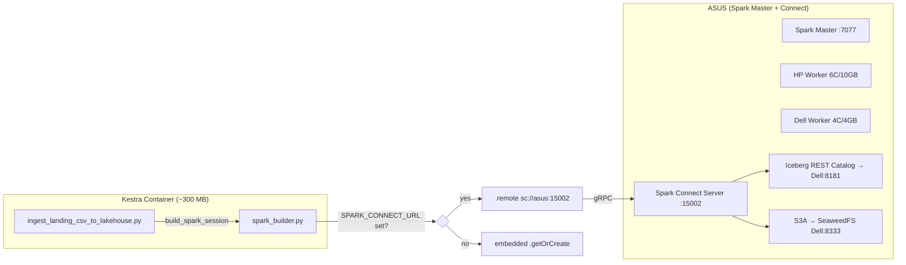

# ADR-011: Separation of Spark Execution from Orchestrator via Spark Connect

## Metadata

**Status:** Proposed
**Version/Date:** v1.0 / 2026-07-23

## Title

Decouple Embedded PySpark from the Kestra Orchestrator Container Using Spark Connect (gRPC)

## Description

We will extract Spark execution (JVM, JARs, DataFrame processing) from the Kestra Worker container into a dedicated Spark Connect Server running on a separate compute node, reducing the orchestrator image from ~4.9 GB to ~300 MB.

## Context

The current `docker/Dockerfile` installs `pyspark` with `sql` and `connect` extras, which pulls the full JVM runtime and all Iceberg/Hadoop JARs into the Kestra Worker container. This produces a 4.9 GB image that must be rebuilt and redeployed for any code change, even when only Python business logic is modified.

The production environment consists of three physical machines on a local network: Dell (storage/S3/Iceberg catalog), HP (16 GB RAM, compute worker), and ASUS (VPN/routing, Spark Master). A Spark standalone cluster already exists — Master on ASUS (`spark://192.168.0.131:7077`), Workers on HP (6 cores / 10 GB) and Dell (4 cores / 4 GB), all in ALIVE state. Despite this, Spark currently runs embedded inside the Kestra container — the same host that runs the orchestrator, ignoring the existing distributed cluster. This conflates two concerns:

1. **Orchestration** (Kestra): schedules flows, manages task dependencies, executes lightweight Python crawling/logging.
2. **Heavy compute** (Spark): reads CSVs from S3, performs MERGE INTO Iceberg tables, handles schema inference.

Embedding Spark inside Kestra forces the orchestrator to carry a full JVM runtime it never uses outside of specific staging jobs, inflating the image, slowing CI/CD pipelines, and coupling two independent operational concerns.

Spark Connect (gRPC-based client/server protocol, stable since Spark 3.4) allows PySpark to act as a thin client that serializes DataFrame operations over gRPC to a remote Spark Server. The client needs only the `pyspark` package with the `connect` extra (~50 MB), not the JVM or JARs. The existing Spark standalone cluster (Master + 2 Workers, 10 cores / 14 GB total) provides the execution backend — only a Connect Server needs to be started on the Master to bridge gRPC to the cluster.

## Decision Drivers

- **Image Size:** 4.9 GB orchestrator image blocks fast iteration. A 300 MB image deploys ~16× faster.
- **Separation of Concerns:** Orchestration scheduling and heavy compute have different uptime, scaling, and debugging requirements.
- **Existing Architecture:** All Spark-consuming functions already accept `SparkSession` as a parameter — no business logic refactoring needed.
- **Existing Infrastructure:** A Spark standalone cluster already runs: Master on ASUS, Workers on HP (6C/10GB) and Dell (4C/4GB). Embedded Spark ignores this investment.
- **Operational Resilience:** If the Spark Connect Server restarts, Kestra flows retry via the existing RunsLogger fault isolation (ADR-007). If Kestra restarts, Spark jobs on HP continue unaffected.

## Alternatives

- **Option A (Keep Embedded Spark — Status Quo):** Continue shipping the full JVM inside the Kestra container.
  - *Pros:* No new infrastructure, no gRPC dependency, simpler local development.
  - *Cons:* 4.9 GB image, conflates compute and orchestration, ignores multi-machine topology.
- **Option B (Spark Connect via Existing Cluster):** Start a Spark Connect Server on the existing Master (ASUS), keep a thin PySpark client in Kestra. Workers on HP and Dell already running.
  - *Pros:* 16× smaller orchestrator image, reuses existing cluster (no new containers), code already compatible.
  - *Cons:* Spark Connect Server process to manage on ASUS, gRPC adds ~2-5 ms LAN overhead (negligible), local dev requires embedded fallback.
- **Option C (Spark Job Server / Livy REST API):** Submit Spark jobs via REST API instead of gRPC.
  - *Pros:* REST is universally debuggable with curl, mature Livy ecosystem.
  - *Cons:* Livy is semi-abandoned (last Apache release 2020), REST overhead for DataFrame serialization is higher than gRPC, requires job packaging as JARs/Python files rather than interactive sessions.

### Decision Framework

| Model / Option                        | Image Size Reduction (Weight: 30%) | Code Change Surface (Weight: 35%) | Operational Fit (Weight: 35%) | Total Score | Decision       |
| ------------------------------------- | ---------------------------------- | --------------------------------- | ----------------------------- | ----------- | -------------- |
| **Option B (Spark Connect Split)**    | 10/10 (3.0)                        | 10/10 (3.5)                       | 9/10 (3.15)                   | **9.65/10** | ✅ **Selected** |
| Option A (Status Quo Embedded)        | 0/10 (0.0)                         | 10/10 (3.5)                       | 5/10 (1.75)                   | 5.25/10     | Rejected       |
| Option C (Livy REST API)              | 9/10 (2.7)                         | 5/10 (1.75)                       | 7/10 (2.45)                   | 6.90/10     | Rejected       |

## Decision

We will adopt **Option B (Spark Connect gRPC Client/Server Split)** to decouple Spark execution from the Kestra orchestrator. The `build_spark_session()` factory in `src/entsoe_pipeline/spark/spark_builder.py` will detect the `SPARK_CONNECT_URL` environment variable. When set, it returns a thin gRPC-backed `SparkSession` pointing to the remote Spark Connect Server. When absent, it falls back to the existing embedded Spark for local development. A Spark Connect Server process is started on the existing Master node (ASUS), bridging gRPC to the already-running standalone cluster (`spark://192.168.0.131:7077`). Workers on HP (6C/10GB) and Dell (4C/4GB) provide execution. The Connect Server is configured with the same Iceberg/S3 connector JARs and catalog settings currently defined in `spark_builder.py`. No new Docker containers are required — the cluster infrastructure already exists. This decision does not supersede any previous ADRs.

## High-Level Architecture

The existing Spark standalone cluster is reused as-is. A Spark Connect Server is started on the Master node (ASUS) as a gRPC bridge — the thin client in Kestra connects to it, and the Connect Server delegates execution to the existing Workers on HP and Dell.

```
┌─ Kestra Container (Dell) ─┐      ┌─ ASUS (Spark Master + Connect) ─┐
│                            │      │                                  │
│  Kestra Worker             │gRPC  │  Spark Connect Server :15002     │
│  ├─ Python crawlers        │─────►│  └─► Spark Master :7077          │
│  └─ spark_builder.py       │      │        ├─► HP Worker (6C/10GB)   │
│      .remote(sc://asus...) │◄─────│        └─► Dell Worker (4C/4GB) │
│                            │gRPC  │                                  │
│  Image: ~300 MB            │      │  (cluster already exists)        │
└────────────────────────────┘      └──────────────────────────────────┘
```

The gRPC boundary is transparent to all existing business logic. Functions like `read_landing_csv_dataset()`, `merge_dataframe_into_table()`, and `add_csv_to_iceberg_table()` receive a `SparkSession` parameter and operate identically regardless of whether it is local or remote.

## Related Requirements

### Functional Requirements

- **FR-1:** Kestra flows must execute Spark staging jobs (CSV ingestion, Iceberg MERGE) without a local JVM in the orchestrator container.
- **FR-2:** Embedded Spark must remain available for local development when `SPARK_CONNECT_URL` is unset.
- **FR-3:** The Spark Connect Server must be configured with the same Iceberg REST catalog, S3A endpoint, and JAR packages as the current embedded session.

### Non-Functional Requirements

- **NFR-1:** **(Separation of Concerns)** Orchestrator image must contain only Python business logic and lightweight dependencies — no JVM, no Spark JARs.
- **NFR-2:** **(Backward Compatibility)** All existing Python code using `SparkSession` as a parameter must work without modification.
- **NFR-3:** **(Operational Independence)** Kestra container restart must not interrupt running Spark jobs on HP. Spark Connect Server restart must be handled by Kestra's existing retry/fault isolation (ADR-007).

### Performance Requirements

- **PR-1:** gRPC serialization overhead between Dell and HP must not exceed 10 ms per DataFrame operation (LAN: ~1 ms ping, overhead dominated by serialization).
- **PR-2:** Spark Workers provide 14 GB combined executor memory (HP: 10 GB, Dell: 4 GB). The existing cluster configuration is sufficient.

### Integration Requirements

- **IR-1:** Spark Connect Server on ASUS:15002 must be reachable from the Kestra container via LAN (`192.168.0.131`).
- **IR-2:** All cluster nodes must have network access to SeaweedFS S3 (Dell:8333) and Iceberg REST catalog (Dell:8181) — already configured in the existing cluster.

## Related Decisions

- **ADR-004** (Ephemeral Landing Zone & Event-Driven Staging): The staging ingestion flow that triggers Spark jobs remains unchanged — only the execution location moves.
- **ADR-007** (Separation of Metadata Refresh from Ingestion): The existing fault isolation pattern in `RunsLogger` handles Spark Connect Server unavailability via retry and DLQ logging.
- **ADR-010** (Dynamic Schema Inference Fallback): The schema inference code in `landing_csv_reader.py` operates on the same DataFrame API, transparently serialized over gRPC.

## Design

### Architecture Overview

The change is confined to a single module: `spark_builder.py`. All downstream consumers of `SparkSession` are parameterized and require no modification.



### Implementation Details

**In `src/entsoe_pipeline/spark/spark_builder.py`:**

The existing `build_spark_session()` gains an environment-controlled branch. No existing configs, catalog settings, or JAR coordinates are removed — they remain active in the embedded path and are mirrored in the Spark Connect Server startup.

```python
import os
from pyspark.sql import SparkSession

def build_spark_session(app_name: str = "ENTSOE_Lakehouse") -> SparkSession:
    connect_url = os.environ.get("SPARK_CONNECT_URL")

    if connect_url:
        return (
            SparkSession.builder
            .remote(connect_url)
            .appName(app_name)
            .getOrCreate()
        )

    # Existing embedded Spark path — unchanged
    hosts = get_hosts_config()
    # ... (all current configs remain exactly as-is)
    return SparkSession.builder.appName(app_name) \
        .config("spark.jars.packages", ...) \
        .getOrCreate()
```

**On the Spark Master (ASUS):**

The existing Spark cluster at `/opt/spark/` (Master already running on `:7077`) is reused. The Spark Connect Server is started as a bridge to the existing Master, forwarding gRPC requests to the Workers on HP and Dell:

```bash
# On ASUS — start Spark Connect Server pointing to existing Master
/opt/spark/sbin/start-connect-server.sh \
  --master spark://192.168.0.131:7077 \
  --conf spark.connect.grpc.binding.port=15002 \
  --packages "org.apache.iceberg:iceberg-spark-runtime-4.1_2.13:1.11.0,org.apache.iceberg:iceberg-aws-bundle:1.11.0,org.apache.hadoop:hadoop-aws:3.4.2" \
  --conf spark.sql.extensions=org.apache.iceberg.spark.extensions.IcebergSparkSessionExtensions \
  --conf spark.sql.catalog.lakehouse=org.apache.iceberg.spark.SparkCatalog \
  --conf spark.sql.catalog.lakehouse.type=rest \
  --conf spark.sql.catalog.lakehouse.uri=http://dell:8181/v1/${S3_TABLE_BUCKET}
```

The Iceberg/S3 catalog and S3A filesystem configs remain as-is in the existing cluster's `spark-defaults.conf` on ASUS — no changes needed there. The Connect Server inherits them from the Master.

### Configuration

The switch is controlled by a single environment variable, consistent with the project's `.env`-for-secrets-only policy (ADR-001, ADR-002). The variable is set in the Kestra container's environment block in `docker-compose.yml`:

```yaml
# In the kestra service definition:
environment:
    - SPARK_CONNECT_URL=sc://asus:15002
```

For local development without Docker, the variable is left unset and `build_spark_session()` falls back to embedded Spark — no developer workflow change required.

The Spark Connect Server's JARs and catalog configurations are declared in `docker-compose.yml` under the `spark-connect` service `command`. They are an exact mirror of the `spark.jars.packages` and catalog configs in the embedded path of `spark_builder.py`. Both paths must be kept in sync when upgrading Iceberg/Spark versions — this is documented as a maintenance note in the Consequences section.

## Testing

**In `tests/spark/test_spark_builder.py`:**

```python
import os
import pytest
from unittest import mock
from entsoe_pipeline.spark.spark_builder import build_spark_session


class TestSparkSessionBuilder:
    """Verify Spark Connect vs embedded branching logic."""

    def test_remote_session_when_connect_url_set(self, monkeypatch):
        """SPARK_CONNECT_URL → .remote() is called, no JVM configs."""
        monkeypatch.setenv("SPARK_CONNECT_URL", "sc://localhost:15002")

        with mock.patch("pyspark.sql.SparkSession.builder") as mock_builder:
            mock_builder.remote.return_value = mock_builder
            mock_builder.appName.return_value = mock_builder
            build_spark_session("test_app")

            mock_builder.remote.assert_called_once_with("sc://localhost:15002")
            # Embedded configs must NOT be called
            mock_builder.config.assert_not_called()

    def test_embedded_session_when_no_connect_url(self):
        """No SPARK_CONNECT_URL → full embedded config path."""
        # Ensure env var is absent
        if "SPARK_CONNECT_URL" in os.environ:
            del os.environ["SPARK_CONNECT_URL"]

        # Cannot fully test .getOrCreate() without a JVM, but verify
        # that the builder chain doesn't call .remote()
        with mock.patch("pyspark.sql.SparkSession.builder") as mock_builder:
            mock_builder.appName.return_value = mock_builder
            mock_builder.config.return_value = mock_builder
            try:
                build_spark_session("test_app")
            except Exception:
                pass  # Expected — no JVM in test environment

            mock_builder.remote.assert_not_called()
            mock_builder.config.assert_called()  # Embedded configs must be invoked

    def test_remote_session_preserves_app_name(self, monkeypatch):
        """App name propagates correctly in remote mode."""
        monkeypatch.setenv("SPARK_CONNECT_URL", "sc://hp:15002")

        with mock.patch("pyspark.sql.SparkSession.builder") as mock_builder:
            mock_builder.remote.return_value = mock_builder
            mock_builder.appName.return_value = mock_builder
            build_spark_session("ENTSOE_Lakehouse")

            mock_builder.appName.assert_called_once_with("ENTSOE_Lakehouse")
```

## Consequences

### Positive Outcomes

- Reduces Kestra orchestrator image size from ~4.9 GB to ~300 MB, cutting build and deploy time by approximately 16×.
- Aligns with existing multi-machine topology: Spark Master on ASUS, Workers on HP (6C/10GB) and Dell (4C/4GB) — all already running in ALIVE state. Zero new containers needed.
- Decouples Spark JVM lifecycle from Kestra — Spark cluster and Connect Server run independently of the orchestrator.
- Zero changes required in business logic — all Spark-consuming functions already accept `SparkSession` as a parameter.
- Embedded fallback preserved for local development with zero configuration.

### Negative Consequences / Trade-offs

- Introduces a Spark Connect Server process on ASUS to manage alongside the existing Master process.
- Spark Connect Server JAR/config must be kept in sync with the existing cluster's `spark-defaults.conf` on ASUS and the embedded path in `spark_builder.py`.
- gRPC adds ~2-5 ms network overhead per DataFrame operation (acceptable on same-LAN deployment).
- Spark Connect does not support all legacy RDD APIs — not relevant here as the project uses only DataFrame API, which is fully supported.
- Debugging Spark failures now requires checking two log sources: Kestra flow logs (client side) and Spark Connect Server logs (server side).

### Ongoing Maintenance & Considerations

- When upgrading `iceberg-spark-runtime` or `hadoop-aws` versions, update: (1) ASUS `spark-defaults.conf` (cluster), (2) `spark_builder.py` (embedded fallback). The Connect Server inherits configs from the Master.
- Monitor gRPC on ASUS:15002 — Spark Connect client raises `grpc.RpcError` on unavailability, caught by the existing DLQ pattern.
- The Spark Connect Server on ASUS should be added to the Grafana dashboard alongside the existing Master (already visible on `:8080`).
- Consider adding a health-check endpoint (`/health` → `spark.range(1).count()`) to the Spark Connect Server for Uptime Kuma monitoring.

### Dependencies

- **Infrastructure**: Existing Spark standalone cluster (ASUS Master + HP/Dell Workers, 10 cores / 14 GB), Docker LAN for Kestra-to-ASUS gRPC.
- **Data Frameworks**: `pyspark` with connect extra >= 4.0.0, `apache-iceberg >= 1.11.0` (via Spark JARs on server), `grpcio` (transitive dependency).
- **Removed from orchestrator image**: `pyspark` with sql extra JVM, `org.apache.iceberg:iceberg-spark-runtime`, `org.apache.hadoop:hadoop-aws` (moved to Spark Connect Server).

## References

- [Spark Connect Overview (Apache Spark 4.1)](https://spark.apache.org/docs/latest/spark-connect-overview.html) — Client/server architecture and gRPC protocol specification.
- [Apache Iceberg Spark Integration](https://iceberg.apache.org/docs/latest/spark-configuration/) — Catalog and FileIO configuration for Spark sessions.
- [ADR-001: Centralized YAML Configuration](docs/adr/ADR-001-centralized-yaml-configuration.md) — Config SSOT pattern; `SPARK_CONNECT_URL` follows the `.env`-for-secrets-only rule.
- [ADR-004: Ephemeral Landing Event-Driven Staging](docs/adr/ADR-004-ephemeral-landing-event-driven-staging.md) — Staging ingestion flow that invokes Spark jobs.
- [ADR-007: Separation of Metadata Refresh from Ingestion](docs/adr/ADR-007-separation-of-metadata-refresh-from-ingestion.md) — Fault isolation and DLQ pattern reused for Spark Connect failures.

## Changelog

- **v1.0** (2026-07-23): Initial proposed version. Spark Connect split design with embedded fallback.
